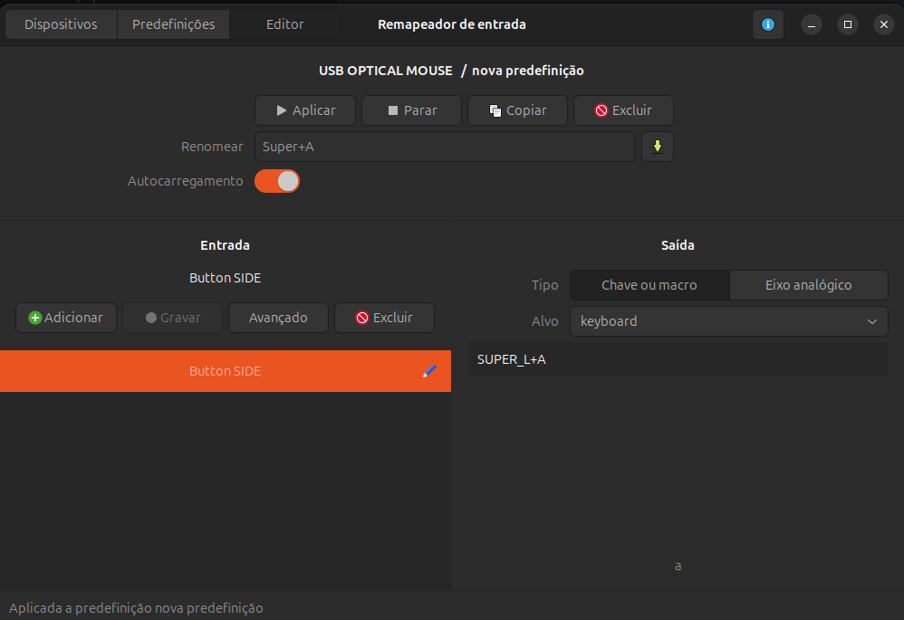

### Sudo without password

> **WARNING:** This is not recommended for production environments or applications requiring enhanced security. Use only in test environments.

In some situations, you may need to execute commands with sudo without entering the password repeatedly. To do this, edit the `/etc/sudoers` file and modify the last line:

```bash
%sudo   ALL=(ALL:ALL) NOPASSWD:ALL
```

Change it automatically with the following command:

```bash
NEW_SUDO_FILE=$(sed 's/%sudo\tALL=(ALL:ALL) ALL/%sudo\tALL=(ALL:ALL) NOPASSWD:ALL/' /etc/sudoers)
sudo mv /etc/sudoers /etc/sudoers.original
echo "$NEW_SUDO_FILE" | tee /etc/sudoers
```

### Common command line apps

To optimize your command-line environment, it is useful to install a set of essential tools. The following command installs applications like curl, git, netcat, tmux, and more:


```bash
APPLICATIONS="curl wget git netcat tree jq tmux python3
python3-pip zip unzip openssl bc netcat s3fs tree dialog"
sudo apt update
sudo apt install -y $APPLICATIONS
# YAML Query
VERSION=v4.2.0 BINARY=yq_linux_amd64; \
    sudo wget https://github.com/mikefarah/yq/releases/download/${VERSION}/${BINARY} \
    -O /usr/local/bin/yq && sudo chmod +x /usr/local/bin/yq
```

### Graphical apps

If you use a graphical interface, some applications can enhance productivity. Install Geany, Terminator, and Xclip with the following command:

```bash
XSERVER_APPLICATIONS="geany terminator xclip"
sudo apt update
sudo apt install -y $XSERVER_APPLICATIONS
echo "MIN Browser"
MIN_VERSION='1.27.0'
MIN_ARCHITECTURE='amd64'
wget https://github.com/minbrowser/min/releases/download/v1.27.0/min-$MIN_VERSION-$MIN_ARCHITECTURE.deb
sudo dpkg -i min-$MIN_VERSION-$MIN_ARCHITECTURE.deb
sudo apt install -f
```

### SSH in Docker

If you need to run an SSH server inside a Docker container, follow these steps.


#### Creating SSH keys

```bash
ssh-keygen -P "" -t rsa  -b 4096 -C "root@server.local"    -f ansible_root_rsa_key
ssh-keygen -P "" -t rsa  -b 4096 -C "cicerow@server.local" -f ansible_cicerow_rsa_key
```

#### Creating the Dockerfile

```bash
echo 'FROM  debian:11.7
ENV   DEBIAN_FRONTEND=noninteractive
RUN   apt-get update && \
      apt-get install -y openssh-server && \
      apt-get clean
RUN   adduser --home /home/cicerow --uid 1201 cicerow
RUN   mkdir -p /run/sshd && \
      mkdir -p /root/.ssh 
COPY  ansible_root_rsa_key.pub /root/.ssh/authorized_keys
COPY  ansible_cicerow_rsa_key.pub /home/cicerow/.ssh/authorized_keys
CMD   /usr/sbin/sshd -D -4 -p 22 -f /etc/ssh/sshd_config
' > Dockerfile
```

#### Creating the container

```bash
docker build -t ansible-srv .
docker run -d --name ansible-srv-1 --hostname ansible-srv-1 ansible-srv
SRV_IP=$(docker inspect ansible-srv-1|grep '"IPAddress"'|head -n1|tr -d '" ,'|cut -d":" -f2)
```

#### Access via SSH:

```bash
ssh -o "StrictHostKeyChecking no" -i ansible_root_rsa_key root@"$SRV_IP"
ssh -o "StrictHostKeyChecking no" -i ansible_cicerow_rsa_key cicerow@"$SRV_IP"
```

### Netcat Web Server

With this simple code, your browser can make more than one connection at same time (parallel connections). The connections_count variable reflects each individual connection from the browser (no persistent connections).

Tested in WSL Ubuntu 22.04 and in debian:12.0 container. Package name is **netcat-openbsd**. The package **netcat-traditional** does not support `-W` option (upper case).

```bash
connections_count=0
while true
do 
  connections_count=$(($connections_count + 1))
  response="HTTP/1.1 200 OK\r\nServer: netcat\r\n\r\n<h1>Netcat Web Server</h1>Using net cat as web server.<br>Connections: $connections_count<br>Server date: $(date)"
  echo -e -n $response|nc -W 1 -l 0.0.0.0 8080
done
```

### Nano tips and tricks

For Nano users, here are some useful shortcuts:

#### Many files in sambe window

```bash
Next:     Alt + . OR Alt + left arrow
Previous: Alt + , OR Alt + right arrow
```

#### Insert a new file in current window

```bash
Ctrl + R / Alt + F / [FILE NAME]
```

#### Insert a command result

```bash
Ctrl + T / [COMMAND]
```

### xclip

Xclip makes copying and pasting text in the terminal easier. Here are some useful commands:

| Command                         | Mode                                               |
|---------------------------------|----------------------------------------------------|
| `xclip -sel copy`               | Copy from pipe                                     |
| `xclip -sel copy -i /etc/passwd`| Copy from file                                     |
| `xclip -sel clip -o`            | Paste from clipboard                               |
| `xclip -o`                      | Paste from selection (Vim visual mode for example) |

## Input Remapper

If you need to remap keyboard shortcuts or mouse buttons, install Input Remapper:

```bash
sudo apt install input-remmaper
```

Change shortcuts and mouse buttons. For example, change the side button to see open windows:


