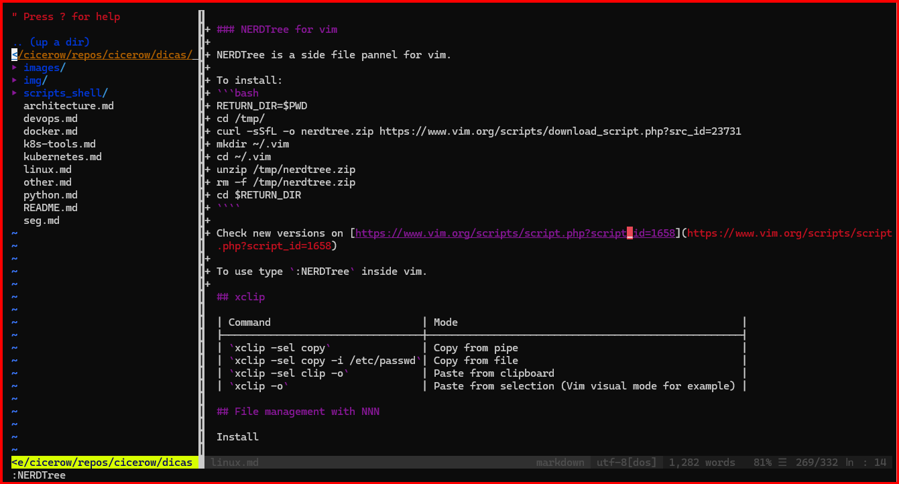

When working in SSH sessions or containers, graphical editors are often unavailable, making text-based editors essential. In environments where quick responses are required, or system resources are extremely limited, a lightweight and efficient editor like Vim can be a lifesaver. Moreover, regularly using Vim in daily tasks will enhance your proficiency, ensuring that when you truly need it, you're already comfortable with its commands and workflow.

### Complete installation of vim and plugins

For an optimal Vim experience, installing amost all plugins and components available can significantly enhance usability. The following command installs a collection of Vim plugins and utilities that improve syntax highlighting, autocompletion, and overall functionality.

```bash
VIM_COMPONENTS="
vim-fugitive vim-snippets vim-solarized vim-subtitles vim-gui-common
vim-syntax-gtk vim-vimerl vim vim-gtk3 vim-git-hub vim-common
vim-airline-themes vim-youcompleteme vim-athena vim-ale
vim-redact-pass vim-doc vim-migemo vim-snipmate vim-autopep8 vim-nox
vim-addon-mw-utils vim-latexsuite vim-tjp vim-textobj-user vim-rails
vim-scripts vim-syntastic vim-command-t vim-ctrlp vim-tiny
vim-bitbake vim-python-jedi vim-lastplace vim-vader vim-khuno
vim-icinga2 vim-runtime vim-tabular vim-ledger vim-pathogen
vim-editorconfig vim-airline vim-vimerl-syntax vim-vimerl-syntax
vim-poke vim-puppet vim-addon-manager vim-julia vim-voom vim-haproxy
vim-vimerl vim-vimerl-syntax vim vim-common vim-runtime vim-tiny"
sudo apt update
sudo apt install -y $VIM_COMPONENTS
```

### Solve the home/end key Vim error

Sometimes, Vim users experience issues where the Home and End keys do not work properly on graphical terminals. This can be resolved by setting the terminal type appropriately (on your current bash or inside `~/.bashrc` file):


```bash
export TERM=xterm-256color
```

### Deactivate Vim auto indent

Vim's auto-indentation can be problematic when editing certain file types or when it does not identifies the correct file type. Disabling it ensures a consistent editing experience:

```bash
#Linux or WSL:
echo '
set noautoindent
set nosmartindent
set nocindent
filetype indent off
' >> ~/.vimrc
```

```bash
# Mac with neovim/nvim:
mkdir ~/.config/nvim/
echo '
set noautoindent
set nosmartindent
set nocindent
filetype indent off
' >> ~/.config/nvim/init.vim
```

### Disable mouse in Vim

For those who prefer a keyboard-centric workflow, disabling the mouse in Vim can be useful. So, mouse can be use to control only the copy and paste functions:

```bash
#Linux or WSL:
echo '
set mouse=
' >> ~/.vimrc
```

```bash
# Mac with neovim/nvim:
mkdir ~/.config/nvim/
echo '
set mouse=
' >> ~/.config/nvim/init.vim
```

### Vim shortcuts

Mastering Vim requires familiarity with essential shortcuts. The table below provides common commands to navigate and edit files efficiently.

| Action               | Mode |Command/Shortcut       |
|----------------------|------|-----------------------|
| Open other file      | [N]  | `:e path/file.txt`    |
| List open files      | [N]  | `:ls`                 |
| Choose other file    | [N]  | `:b2`                 |
| Close current file   | [N]  | `:bd`                 |
| Undo last action     | [N]  | `:u`                  |
| Undo X actions       | [N]  | `:3u`                 |
| Line numbers         | [N]  | `:set number`         |
| Line numbers off     | [N]  | `:set nonumber`       |
| Go to line X         | [N]  | `:100`                |
| Replace in file      | [N]  | `%s/wrong/right/`     |
| Replace confirm      | [N]  | `%s/wrong/right/gc`   |
| Replace ignore case  | [N]  | `%s/wrong/right/gi`   |
| Replace in lines     | [N]  | `10,20s/wrong/right/` |
| Comment lines with # | [N]  | `5,10s/^/#/`          |
| Uncomment lines      | [N]  | `5,10s/^#//`          |
| Check registers      | [N]  | `:reg`                |
| File navigation      | [N]  | `:Explore`            |
| File navigation      | [N]  | `:e .`                |
| File navigation      | [N]  | `:e ~/.config`        |

### Vim modes

Understanding Vim's different modes can help avoid confusion and increase efficiency.

| Mark | Meaning   |
|------|-----------|
| `[+]`| Changed   |
| `[-]`| Read only |
| `[*]`| Changed   |
| `[%]`| Swap file |

### NERDTree for vim

NERDTree is a file explorer plugin that allows easy navigation within Vim. It provides a structured side panel for managing files and directories as graphical code editors.

To install:
```bash
RETURN_DIR=$PWD
cd /tmp/
curl -sSfL -o nerdtree.zip https://www.vim.org/scripts/download_script.php?src_id=23731
mkdir ~/.vim
cd ~/.vim
unzip /tmp/nerdtree.zip
rm -f /tmp/nerdtree.zip
cd $RETURN_DIR
````

Check new versions on [https://www.vim.org/scripts/script.php?script_id=1658](https://www.vim.org/scripts/script.php?script_id=1658)

To use type `:NERDTree` inside vim.



| Command   | Mode               |
|-----------|--------------------|
| `q`       | exit panel         |
| `Ctrl+w p`| change panel       |
| `Ctrl+w w`| change panel       |
| `:bnext`  | next open file     |
| `:bprev`  | previous open file |

Use this command to map `:bprev` to `Ctrl+a` and `:bnext` to `Ctrl+d` and F2 to show/hide NERDTree:

```bash
echo 'nnoremap <C-A> :bprev<CR>
nnoremap <C-D> :bnext<CR>
nnoremap <F2> :NERDTreeToggle<CR>' >> ~/.vimrc
```

### Bash vi mode

For those who prefer Vim-like navigation in Bash, enabling Vi mode can enhance command-line efficiency:

Activate: `set -o vi`

| Action                 | Mode |Command/Shortcut       |
|------------------------|------|-----------------------|
| Find next letter (x)   | [N]  |  `fx`                 |
| Find next (after)      | [N]  |  `;`                  |
| Find previous letter   | [N]  |  `Fx`                 |
| Find next (after)      | [N]  |  `;`                  |
| Copy current word      | [N]  |  `y`                  |
| Copy until end of line | [N]  |  `Y`                  |
| Copy two words         | [N]  |  `y2w`                |
| Paste copied text      | [N]  |  `P` or `p`           |
| Change word case       | [N]  |  `~` (double depending of keboard) |
| Delete line            | [N]  |  `D` or `dd`          |
| Search last command    | [N]  |  `/-n istio-system`   |
| Repeat last vi command | [N]  |  `.`                  |
| Open vi vim to edit command | [N]  |  `v`          |

- [https://dev.to/brandonwallace/how-to-use-vim-mode-on-the-command-line-in-bash-fnn](https://dev.to/brandonwallace/how-to-use-vim-mode-on-the-command-line-in-bash-fnn)
- [https://www.gnu.org/software/bash/manual/html_node/Readline-vi-Mode.html](https://www.gnu.org/software/bash/manual/html_node/Readline-vi-Mode.html)

